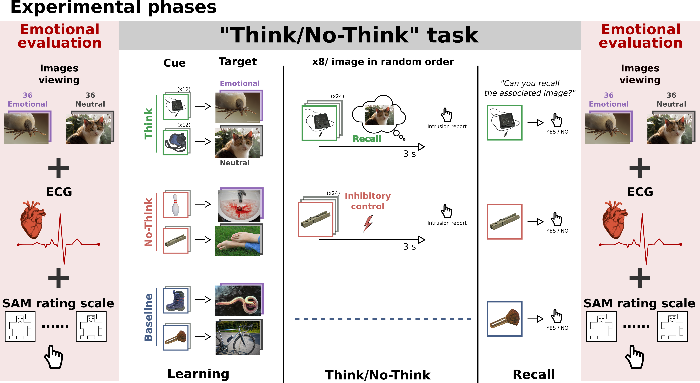
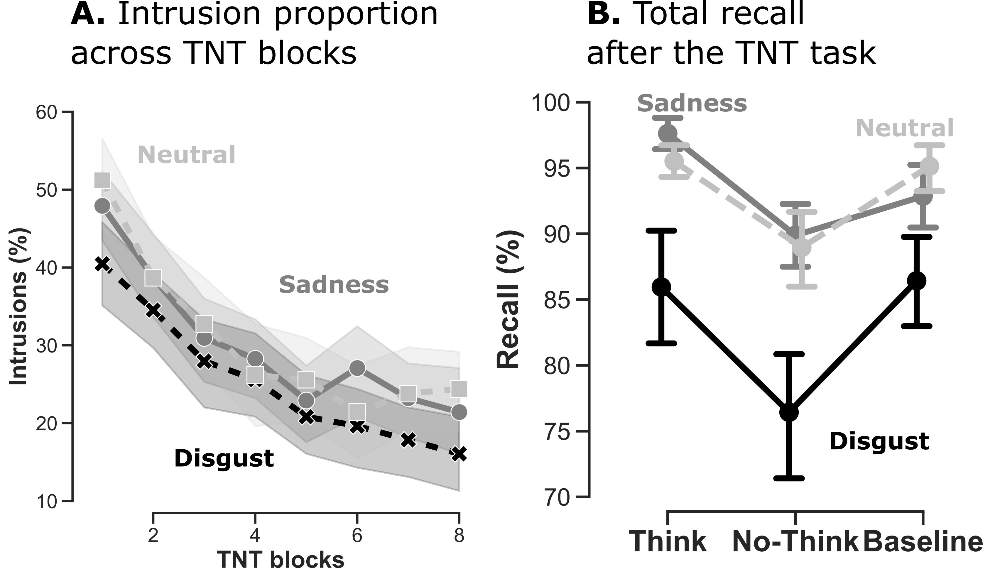
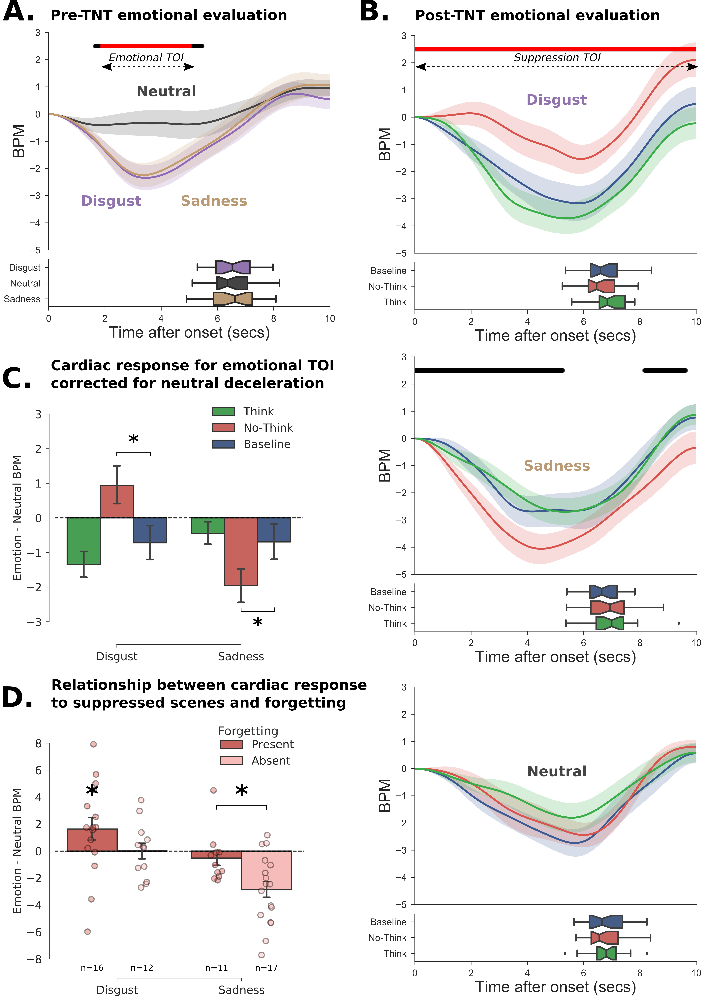
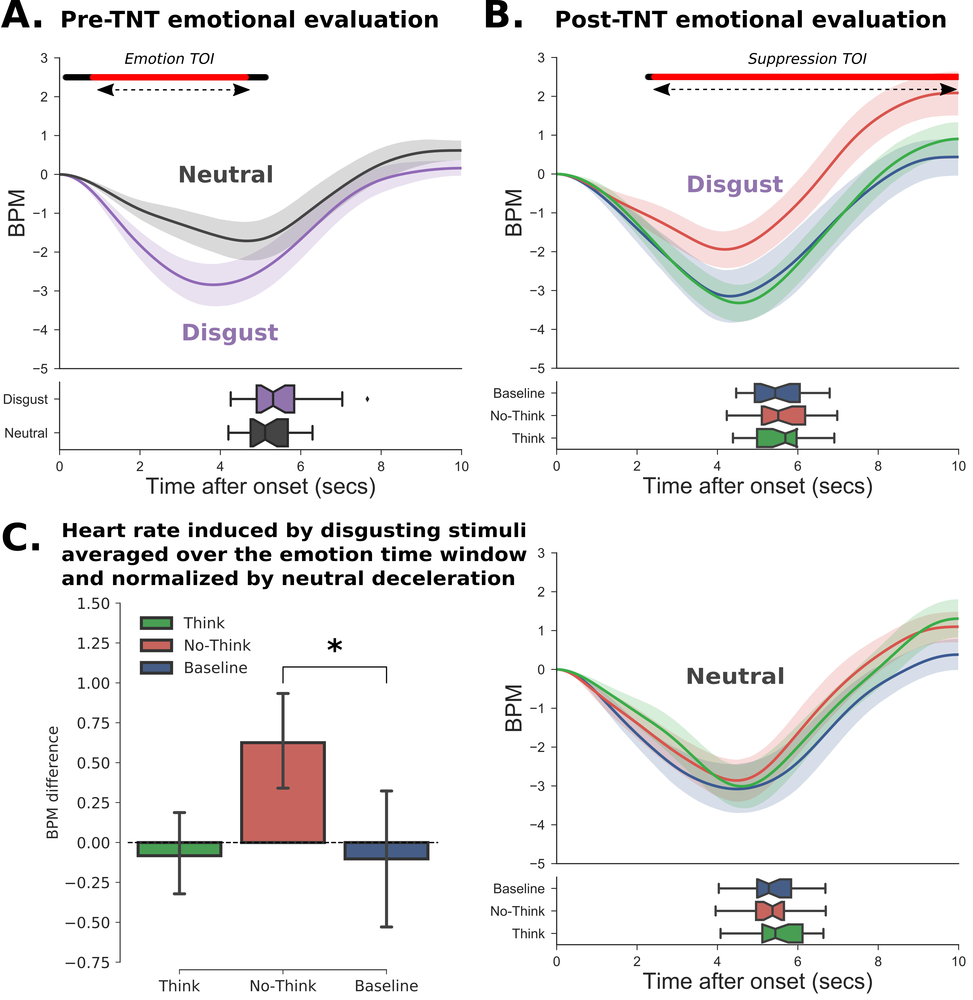
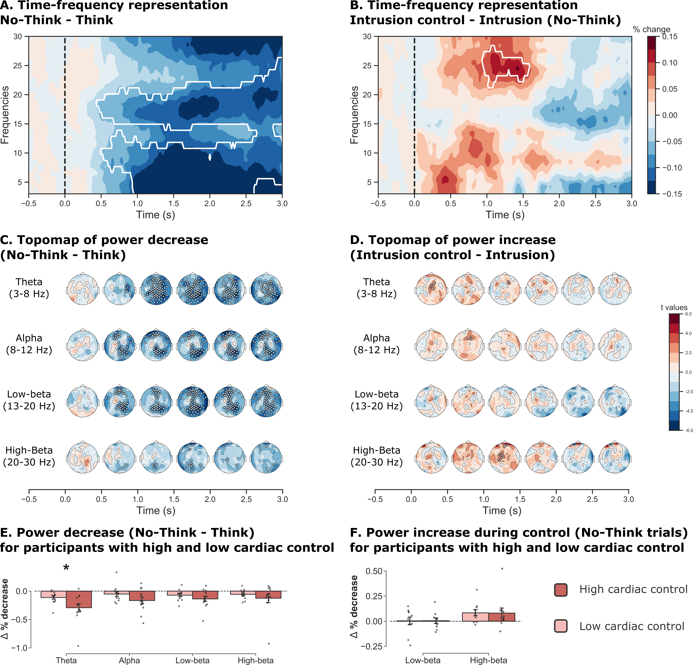
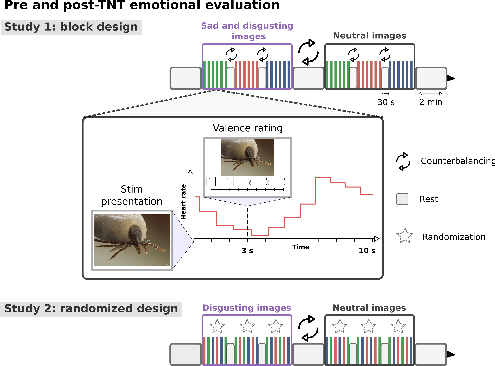
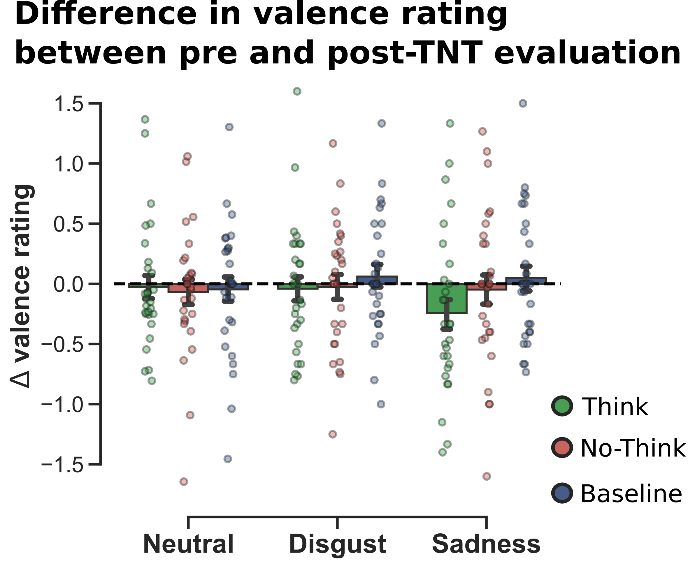
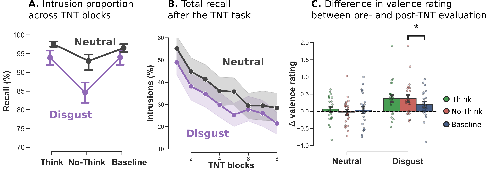

# Does the heart forget? Modulation of cardiac activity induced by inhibitory control over emotional memories.

Legrand, N., Etard, O., Vandevelde, A., Pierre, M., Viader, F., Clochon, P., Doidy, F., Peschanski, D., Eustache, F. & Gagnepain, P. (2018). Preprint version 3.0, doi: https://www.biorxiv.org/content/10.1101/376954v3

This repository contains data, scripts and Jupyter notebook needed to reproduce analyses from the preprint version of the paper.

# Abstract

>Effort to suppress past experiences from conscious awareness can lead to forgetting. It remains largely unknown whether emotions, including their physiological causes, are also impacted by such memory suppression. In two studies, we measured in healthy participants the aftereffect of suppressing negative memories on cardiac response. Results of Study 1 revealed that an efficient control of memories was associated with a long-term inhibition of the cardiac deceleration normally induced by disgusting stimuli. Attempts to suppress sad memories, on the opposite, aggravated cardiac response, an effect that was largely related to the inability to forget this specific material. In Study 2, we found using electroencephalography that a prominent neural marker of inhibitory control, a suppression of the 5-9 Hz frequency band, was related to the subsequent inhibition of the cardiac response. These results demonstrate that suppressing memories also influence the cardiac system, opening new avenues for treating intrusive memories.

# Data

Behavioral data from Study 1 (n=28) and Study 2 (n=24) are provided in `data/Emotion.csv`, `data/Recall.csv` and `data/Intrusions.csv`. Preprocessed ECG are provided in `ECG*.txt` files.

# Code

## Notebooks

Figures and statistical models can be reproduced via two Jupyter Notebook.

* `Behavioral.ipynb` plots the behavioral results and implement the statistical models (require Rpy2).

* `ECG.ipynb` gives additional details on the preprocessing steps of the ECG recording.

## Scripts

### Preprocessing

* `1_run_filter.py` Set montage, filter raw data 1-30 Hz and average reference.

* `2_run_epochs.py` Epoch and clean data with RANSAC.

* `3_run_ica.py` Remove eye activity using ICA.

* `4_run_autoreject.py` Reject/correct artifact with Autoreject.

### Time-frequency

* `5_extract_tfr.py` Filter the epoched data (3-30 Hz, bin = 1 Hz).

* `6_tf_statistcs.py` Average tf, plot and run permutation tests.

# Figures

## Figure 1: Experimental phases

>Experimental phases. After learning pairs consisting of a object and scene pictures, participants performed the think/no-think (TNT) task. The associated scene had either neutral or negative valence. For think items (in green), participants recalled the associated scene. For no-think items (in red), they tried to prevent the scene from entering awareness. The baseline items (in blue) were not presented during the TNT task. We measured subjective (i.e. valence rating) and cardiac reaction toward the scenes before and after the TNT procedure (pre-TNT and post-TNT evaluations). A recall task was also integrated after the TNT phase to estimate memory suppression. **Appendix1** details the methodological differences between Study 1 and 2.

## Figure 2: Behavioral indices of inhibitory control over memory in Study 1 (n=28)

>**A.** Intrusions proportions for No-Think trials (i.e. proportion of trials where the associated memory entered into awareness while participants
were instructed to inhibit recall) over the eight TNT blocks.
Participants increased their ability to control intrusion over the eight
TNT blocks. On average, disgusting pictures were reported less intrusive
than sad or neutral ones. **B.** Total recall after the TNT
procedure. Images in the suppression condition (No-Think) were more
forgotten than baseline for both disgusting and neutral emotion.
However, this effect was not significant for sad stimuli.

## Figure 3: Cardiac response toward stimuli before and after the TNT procedure (Study 1)

> **A.** Cardiac response following the initial presentation of the images before the TNT
task. The curves represent the changes in the number of heartbeat per
minutes (BPM) using the onset of image presentation as a zero starting
point. In the lower panel, the boxplots represent the distribution of
response times for the valence rating. **B.** Cardiac response
after the TNT task for Disgust (top panel), Sadness (middle panel), and
Neutral (bottom panel) images. For each emotion, we represent Think,
No-Think and Baseline items separately (green, red and blue lines
respectively). We observed a significantly reduced deceleration of the
heart rate for disgusting No-Think items compared to baseline, while a
greater deceleration was reported for sad picture in the suppression
condition. For both panel A and B, the black line shows the significant
difference between neutral and emotional (i.e. Disgust + Sadness) evoked
response, while the red line indicates the remaining significance after
FDR correction. **C.** To control for the stronger deceleration
observed for neutral items in the post-TNT evaluation, we computed the
difference between the average heart rate of emotional and neutral
pictures over the significant emotional time window extracted in the
pre-TNT evaluation. The reduced or increased deceleration observed for
No-Think items was still present for Disgusting and Sad pictures,
respectively, even after controlling for the neutral deceleration. This
suggests that the modulation of the cardiac response following memory
suppression cannot be accounted by trivial attentional orientation
processes. **D.** To
explain the opposite modulation observed for Disgust and sadness,~we
split participants according to whether they could suppress or not
emotional scenes from their memory. Participants who were better at
suppressing Disgusting scenes from their memory also showed a reduced
deceleration of cardiac response toward them afterward. On the opposite,
the increased deceleration of cardiac response following the suppression
of sad items was mostly related to participants who could not suppress
them from their memory.

## Cardiac response toward stimuli before and after the TNT procedure (Study 2)

> **A.** Cardiac response following the initial presentation of the images before the TNT task. The curves represent the change in the number of heartbeat per minutes (BPM) taking the onset of image presentation as a zeros starting-point. In the lower panel, the boxplots represent the distribution of response times for the valence rating. **B.** Cardiac response after the TNT task for Disgust (top panel) and Neutral (bottom panel) images. For each emotion, we represent Think, No-Think and Baseline items separately (green, red and blue lines respectively). We observed a significantly reduced deceleration of the heart rate for Disgusting No-Think items compared to Baseline. For both panel A and B, the black line shows the significant difference between neutral and disgust evoked response, while the red line indicates the remaining significance after FDR correction. **C.** The inhibition of cardiac response following memory was still observed even after controlling for the stronger deceleration observed for neutral items in the post-TNT evaluation.

## Event-related spectral perturbations associated with memory suppression and their relation to latter cardiac inhibition.

> **A**. Decrease of frequency power (averaged over the 102 electrodes) during No-Think versus Think trials. This effect was more pronounced for Theta (3-8 Hz), Alpha (8-12 Hz) and Low-beta (13-20 Hz) frequency bands and appeared around 500ms after the cue presentation. White lines show significant cluster (p < 0.05). **B.** Among the No-Think trials, we found an increase in the High-beta frequency band (20-30 Hz) during successful memory control as compared to trials with reported memory intrusions. **C.** Topographic representation of the event-related perturbation for the No-Think - Think contrast. **D.** Topographic representation of the event-related perturbation for the Non-intrusion - Intrusion contrast. The signal change was averaged over 500 ms. Electrodes from significant clusters are represented in white. **E.** Participants with higher cardiac inhibition had also a larger decrease in the Theta frequency band than the participants with a lower level of cardiac inhibition. The cardiac inhibition is measured as the averaged heart rate difference between No-Think and baseline items over the intersection between the emotional and the suppression time-window extracted in the pre- and post-TNT evaluation, respectively. For each participant, we selected the difference in percentage change between 1000 and 2500 ms after the cue presentation. This difference was not found for other frequency bands (two-tailed Mann-Whitney rank test. **F.** We did not find a difference of Beta frequency power between participants with high and low cardiac inhibition (time-window of interest between 1000 and 1500 ms after reminder onset).

## Appendix 1: Pre and post-TNT emotional evaluation

> Emotional assessment in Study 1 included a block design during which stimulus presentation alternate between discrete epochs of scenes drawn from the same condition (i.e.Think, No-Think, and Baseline). This design was intended to optimize the detection of differences in heartbeats which may have only arisen in the low-frequency range. One potential problem with blocked designs, however, is that the response to events within a block may be confounded by the context of their occurrence (e.g. when participants become aware of the blocking and may alter their strategies/attention as a consequence). To control for that potential bias, Study 2 used a design in which the presentation of Think, No-Think, and Baseline items was randomized and unpredictable. However, we kept emotion and neutral conditions presented in separated blocks to control for long-term autonomic change induced by emotions that may spread over and modulate cardiac response to neutral scenes. In addition, in Study 1, an arousal scale was also presented at the bottom of the screen, ranging from 1 (corresponding to a calm face on the far left of the scale) if a picture made them feel completely relaxed, to 9 (corresponding to an excited face on the far right if a picture made them feel completely aroused). If participants felt neutral, neither relaxed nor aroused, they were then instructed to press the square under the figure in the middle position. This last change explains the difference in mean response time between Study 2 and Study 1.

## Appendix 2: Difference in valence rating between pre and post-TNT evaluation

> We found no significant differences in term of subjective rating for the
No-Think pictures as compared to baseline in any of the three emotional
conditions. Shaded error bands and error bars represent the bootstrapped
standard-error of the mean.

## Appendix 3 : Behavioral indices of inhibitory control and evolution of emotional appreciation in Study 2 (n=24)

> **A.** Intrusions proportions for No-Think trials (i.e. proportion of trials where the associated memory entered into awareness while participants
were instructed to inhibit recall) over the eight TNT blocks.
Participant increased their ability to control intrusion over the eight
TNT blocks. On average, disgusting pictures were reported less intrusive
than neutral ones.**B.** Total recall after the TNT procedure.
Images in the suppression condition (No-Think) were more forgotten than
baseline for disgusting items, an effect that was not found for the
neutral emotion. **C.** Difference in valence rating between pre-
and post- TNT evaluation. We found a significant difference in valence
rating between No-Think and Baseline pictures for disgust, but this
effect was not significant for neutral items. Shaded error bands and
error bars represent the bootstrapped standard-error of the mean.
